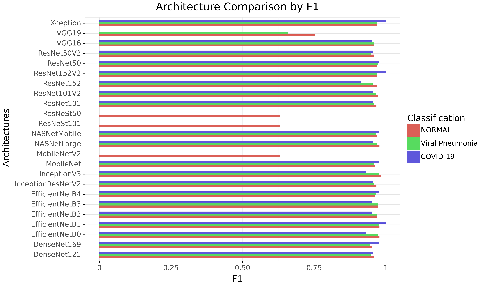
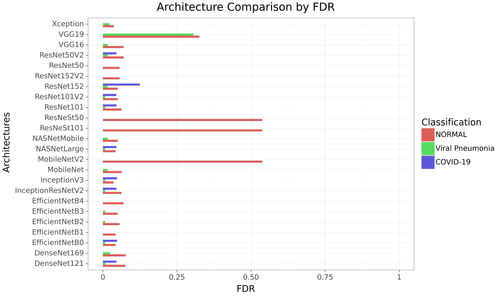

# An analysis on Ensemble Learning optimized Medical Image Classification with Deep Convolutional Neural Networks

https://towardsdatascience.com/ensembles-the-almost-free-lunch-in-machine-learning-91af7ebe5090

--------------------------------------------

For multi-label classification:
- Sigmoid instead of softmax
- Use binary_crossentropy instead of categorical

ensmeble learning output
class & probability/confidence (for ROC)

--------------------------------------------

Pre-Sampling:
- 65% train-model
- 10% val-model
- 10% val-ensemble
- 15% test

## Analysis Phases:

### Phase 1:

Analyze all architectures with 1x train-model & 1x val-model   
->   Predict on 1x val-ensemble and 1x test set

Additional:  
memory vs performance  
model complexity vs performance  

### Phase 2:

Analyze all implemented ensemble techniques given all predictions of 1) and validation set -> Testing  
(can model importance be calculated?)  

Train each ensemble method on models predictions for 1x val-ensemble set

Run classifier on predictions for 1x test set

### Phase 3:
Utilizing data augmentation for inference.

One model -> Multiple predictions on data augmentated testing -> ensemble learning -> final prediction

1x train-model & 1x val-model
-> Multiple predictions on 1x val-ensemble & 1x test set
-> Ensemble Learning on 1x val-ensemble
-> Evaluation on 1x test set

### Phase 4:
Use top-3 models and top-3 ensemble methods:  

Setup:  
for each top3 architecture:
  model-set = train-model + val-model
  perform 5-CV on model-set
  for each fold:
    predict on val-ensemble
    predict on test
  for each top3 ensembler:
    train ensembler on 5-CV models predictions for val-ensemble
    predict on test using the 5-CV model predictions


Note: 3-CV instead of 5-CV?

--------------------------------------------------------------------------------

## First Results

**Phase I:**  





--------------------------------------------------------------------------------

## Usage

```sh
python ensmic/preprocessing/prepare_fs.xray.py
```

```sh
python ensmic/phase_one/training.py -m "x-ray"
python ensmic/phase_one/training.py -m "ct"
```

--------------------------------------------------------------------------------
Interesting datasets:

Focus on multi-class tasks in order to obtain more difficult tasks instead of binary task.  

1) X-Ray COVID19 (multi-class)
Classes: Pneumonia, COVID-19, NORMAL
https://www.kaggle.com/tawsifurrahman/covid19-radiography-database

https://ieeexplore.ieee.org/document/9144185
M.E.H. Chowdhury, T. Rahman, A. Khandakar, R. Mazhar, M.A. Kadir, Z.B. Mahbub, K.R. Islam, M.S. Khan, A. Iqbal, N. Al-Emadi, M.B.I. Reaz, M. T. Islam, “Can AI help in screening Viral and COVID-19 pneumonia?” IEEE Access, Vol. 8, 2020, pp. 132665 - 132676.

2) The ISIC 2019 Challenge Dataset (multi-class)

Multi-class dataset with 25,331 images and 9 classes.

Didn't use ISIC 2020 (33,126) due to binary classification.  
Aim: More difficult task in order to better evaluate ensemble learning performance gain.  
https://challenge2020.isic-archive.com/


3) Retinal Image Analysis for multi-Disease Detection Challenge (binary)

https://riadd.grand-challenge.org/Home/

- Classification into normal/abnormal


List:
https://github.com/sfikas/medical-imaging-datasets
